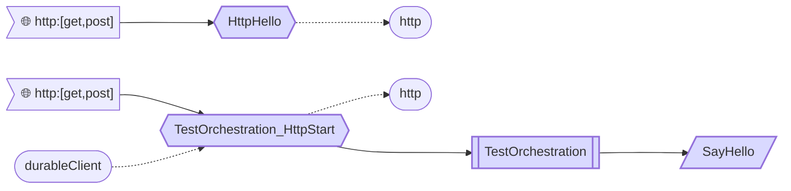
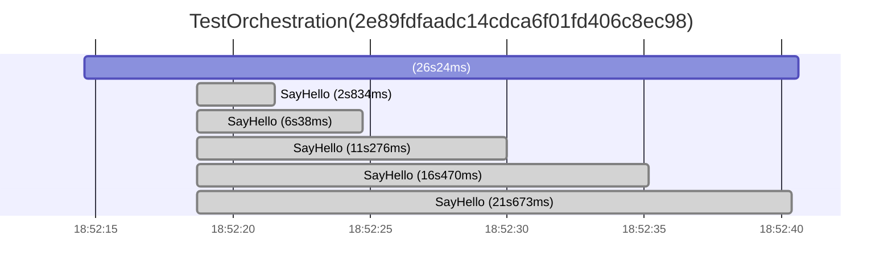

# ThrottlingTrollSampleDotNet6InProcDurableFunction

Demonstrates how to use ThrottlingTroll's egress throttling capabilities in a [.NET 6 InProc Azure Function](https://learn.microsoft.com/en-us/azure/azure-functions/functions-dotnet-class-library).



Activity Function uses a ThrottlingTroll-equipped HttpClient instance to make API calls. That HttpClient instance is configured to make no more than 1 request per 5 seconds. When that limit is exceeded, it will automatically wait _without_ making the actual call. Orchestration execution timeline therefore typically looks like this:


## How to run locally

As a prerequisite, you will need [Azure Functions Core Tools globally installed](https://learn.microsoft.com/en-us/azure/azure-functions/functions-run-local#install-the-azure-functions-core-tools).

If you run this code on a GitHub Codespaces instance, then everything (including Redis server) should be pre-installed and ready for you.

1. (Optional, if you want to use **RedisCounterStore**) Add `RedisConnectionString` setting to [local.settings.json](https://github.com/ThrottlingTroll/ThrottlingTroll/blob/main/samples/ThrottlingTrollSampleDotNet6InProcDurableFunction/local.settings.json) file. For a local Redis server that connection string usually looks like `localhost:6379`. 

2. Open your terminal in `samples/ThrottlingTrollSampleDotNet6InProcDurableFunction` folder and type the following:
```
func start
```
